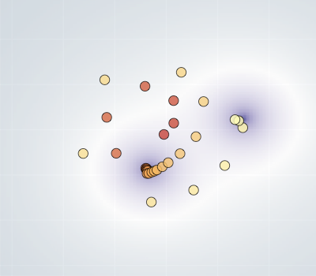

# Deep Adaptive Design
This code supports the ICML paper [Deep Adaptive Design: Amortizing Sequential Bayesian Experimental Design](https://arxiv.org/abs/2103.02438).
Our code extends [Pyro](https://github.com/pyro-ppl/pyro).




## Computing infrastructure requirements
We have tested this codebase on Linux (Ubuntu 16.04 and Fedora 32) with Python 3.8.
To train design networks, we recommend the use of a GPU, we used one GeForce GTX 1080
Ti GPU on a machine with 126 GiB of CPU memory and 8 CPU cores.

## Environment setup
1. Ensure that Python and `venv` are installed.
1. Create and activate a new `venv` virtual environment as follows
```bash
python3 -m venv dad_code
source dad_code/bin/activate
```
1. Install the correct version of PyTorch following the instructions at [pytorch.org](https://pytorch.org/).
   We used `torch==1.7.1` with CUDA version 11.1.
1. Install the remaining package requirements using `pip install -r requirements.txt`.

## MLFlow
We use `mlflow` to log metric and store network parameters. Each experiment run is stored in
a directory `mlruns` which will be created automatically. Each experiment is assigned a
numerical `<ID>` and each run gets a unique `<HASH>`.

You can view the experiments and the runs in browser by starting an `mlflow` server:
```bash
mlflow ui
```

## Experiment: Location Finding

To train a DAD network using the approach in the paper, execute the command
```bash
python3 location_finding.py \
    --num-steps 50000 \
    --num-inner-samples 2000 \
    --num-outer-samples 2000 \
    -p 2 \
    --num-sources 2 \
    --noise-scale 0.5 \
    --base-signal 0.1 \
    --max-signal 1e-4 \
    --lr 5e-5 \
    --gamma 0.98 \
    --num-experiments 30 \
    --encoding-dim 16 \
    --hidden-dim 256 \
    --design-network-type dad \
    --device <DEVICE> \
    --mlflow-experiment-name location_finding
```
where `<DEVICE>` should be `cuda` or `cuda:i` to select a GPU, or `cpu` for CPU-only training (not recommended).

To learn a fixed (static) design strategy, run the following command:

```bash
python3 location_finding.py \
    --num-steps 50000 \
    --num-inner-samples 2000 \
    --num-outer-samples 2000 \
    -p 2 \
    --num-sources 2 \
    --noise-scale 0.5 \
    --base-signal 0.1 \
    --max-signal 1e-4 \
    --lr 0.0001 \
    --gamma 0.98 \
    --num-experiments 30 \
    --design-network-type static \
    --device <DEVICE> \
    --mlflow-experiment-name location_finding
```

To set-up a design network with random designs, run the following command:

```bash
python3 location_finding.py \
    --design-network-type random \
    -p 2 \
    --num-sources 2 \
    --noise-scale 0.5 \
    --base-signal 0.1 \
    --max-signal 1e-4 \
    --num-experiments 30 \
    --device cpu \
    --mlflow-experiment-name location_finding
```

To run the variational baselines for location finding, run the following command:
```bash
python3 location_finding_variational.py \
    --num-loop 256 \
    --num-experiments 30 \
    --oed-num-inner-samples 500 \
    --oed-num-outer-samples 500 \
    --vi-num-steps 5000 \
    --oed-num-steps 5000 \
    --device <DEVICE> \
    --mlflow-experiment-name location_finding
```

### Location Finding Evaluation

All results from the experiment, which we called `location_finding`, will be saved in  `mlruns/<ID>/`. The `<ID>` will be printed at the end of each run.

Once some (or all) of the commands above are executed, the resulting design strategies can be evaluated.
To evaluate the upper and lower bounds on the total EIG for the trained networks,
use the code below, setting the mlflow experiment id `<ID>` as an `--experiment-id` argument.

```
python3 location_finding_eval.py \
    --experiment-id <ID> \
    --device <DEVICE> \
    --n-rollout 2048 \
    --num-inner-samples 500000
```

The lower and the upper bounds will be printed and will also be stored in mlflow under `metrics`.


## Experiment: Hyperbolic Temporal Discounting
To train a DAD network using the approach in the paper, execute the command
```bash
python3 hyperbolic_temporal_discount.py \
    --num-steps 100000 \
    --num-inner-samples 500 \
    --num-outer-samples 500 \
    --lr 1e-4 \
    --gamma 0.96 \
    --num-experiments 20 \
    --device <DEVICE> \
    --encoding-dim 16 \
    --hidden-dim 256 \
    --num-layers 2 \
    --learn-alpha \
    --arch sum \
    --mlflow-experiment-name temporal_discounting
```

To learn a fixed design, use
```bash
python3 hyperbolic_temporal_discount.py \
    --num-steps 100000 \
    --num-inner-samples 500 \
    --num-outer-samples 500 \
    --lr 1e-1 \
    --gamma 0.96 \
    --num-experiments 20 \
    --device <DEVICE> \
    --learn-alpha \
    --arch static \
    --mlflow-experiment-name temporal_discounting
```
For the Badapted baseline of Vincent & Rainforth (2017), we used the public code provided in the [Badapted repo](https://github.com/drbenvincent/badapted).
For the baselines of Frye et al. (2016) and Kirby (2009),
we used the public code provided in the [DARC toolbox repo](https://github.com/drbenvincent/darc-experiments-matlab/), which we reimplemented in Python.

### Total Enumeration
To train a DAD network using total enumeration (as opposed to score gradients), use the following command
```bash
python3 hyperbolic_temporal_discount.py \
    --num-steps 50000 \
    --num-inner-samples 500 \
    --num-outer-samples 500 \
    --lr 1e-4 \
    --gamma 0.96 \
    --num-experiments 10 \
    --device <DEVICE> \
    --encoding-dim 16 \
    --hidden-dim 256 \
    --num-layers 2 \
    --learn-alpha \
    --arch sum \
    --complete-enum \
    --mlflow-experiment-name temporal_discounting
```


### Hyperbolic Temporal Discounting Evaluation
All results from the experiment, which we called `temporal_discounting`, will be saved in  `mlruns/<ID>/`. The `<ID>` will be printed at the end of each run.

Once some (or all) of the commands above are executed, the resulting design strategies can be evaluated.
To evaluate the upper and lower bounds on the total EIG for the trained networks,
use the code below, setting the mlflow experiment id `<ID>` as an `--experiment-id` argument.

```bash
python3 hyperbolic_temporal_discount_eval.py \
    --experiment-id <ID> \
    --device <DEVICE>
```

## Experiment: Death Process
To train a DAD network using the approach in the paper, execute the command
```bash
python3 death_process.py \
    --num-steps 100000 \
    --num-inner-samples 500 \
    --num-outer-samples 500 \
    --lr 0.001 \
    --gamma 0.96 \
    --num-experiments 4 \
    --device <DEVICE> \
    --encoding-dim 16 \
    --arch sum \
    --mlflow-experiment-name death_process
```

To learn a Fixed design, use
```bash
python3 death_process.py \
    --num-steps 100000 \
    --num-inner-samples 500 \
    --num-outer-samples 500 \
    --lr 1e-1 \
    --gamma 0.85 \
    --num-experiments 4 \
    --device <DEVICE> \
    --arch static \
    --mlflow-experiment-name death_process
```

For the variational baseline, use the following command
```bash
python3 death_process_variational.py \
    --num-loop 500 \
    --vi-lr 1e-3 \
    --vi-gamma 0.2 \
    --oed-lr 1e-2 \
    --oed-gamma 0.9 \
    --oed-num-inner-samples 250 \
    --oed-num-outer-samples 250 \
    --num-experiments 4 \
    --device <DEVICE> \
    --mlflow-experiment-name death_process
```

For the SeqBED baseline, we used code in the [SeqBED repo](https://github.com/stevenkleinegesse/seqbed).

### Death Process Evaluation
All results from the experiment, which we called `death_process`, will be saved in  `mlruns/<ID>/`. The `<ID>` will be printed at the end of each run.

Once some (or all) of the commands above are executed, the resulting design strategies can be evaluated.
To evaluate the upper and lower bounds on the total EIG for the trained networks,
use the code below, setting the mlflow experiment id `<ID>` as an `--experiment-id` argument.

```bash
python3 death_process_eval.py \
    --experiment-id <ID> \
    --device <DEVICE>
```

## Using this codebase for new models
Our code can easily be extended to train a DAD network for other models defined in [Pyro](https://github.com/pyro-ppl/pyro).
We suggest building off of our existing examples e.g.`location_finding.py`.
We introduce two new Pyro primitives
 - `compute_design` which registers designs as Pyro variables
 - `observation_sample` which is used to sample experiment observations

Both are simple wrappers around `pyro.sample`, using them is necessary for computing contrastive MI estimates, such as `PriorContrastiveEstimation`.
The tools used in this repository are not compatible with `pyro.contrib.oed`.

## Cite
If you use this codebase, please consider citing the [DAD paper](https://arxiv.org/abs/2103.02438)
```
@article{foster2021deep,
  title={Deep Adaptive Design: Amortizing Sequential Bayesian Experimental Design},
  author={Foster, Adam and Ivanova, Desi R and Malik, Ilyas and Rainforth, Tom},
  journal={arXiv preprint arXiv:2103.02438},
  year={2021}
}
```
